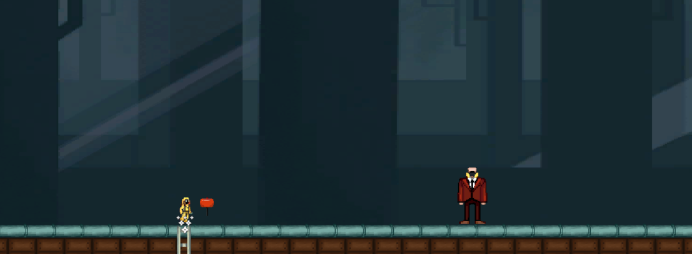
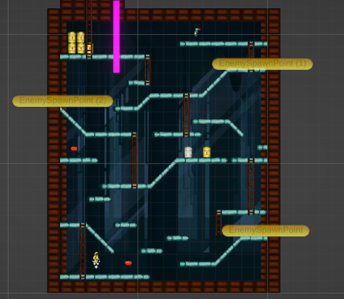

  

# Nuclear-Kong

A game built in **Unity (C#)** for a game-jam **lighting round** — a small, time-boxed arcade idea shipped in a single session.

Built fast, on purpose: this repo is a snapshot of what can be produced when the constraint is the clock. It leans on rule tiles for level construction and a VFX toolkit for juice.

## Screenshots

## Getting started

Open in **Unity 6** (`6000.0.x`) and open the game scene under `Assets/Levels/`.

## Notes

- Game-jam scope: expect rough edges and minimal polish — that is the point of the exercise.
- Vendored plugins (`Assets/Plugins/`) are third-party assets used under their own licenses.

## Related

One of the game-jam titles in [the author's portfolio](https://github.com/WMsans).
